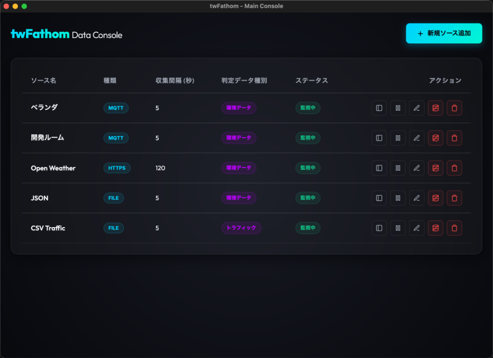
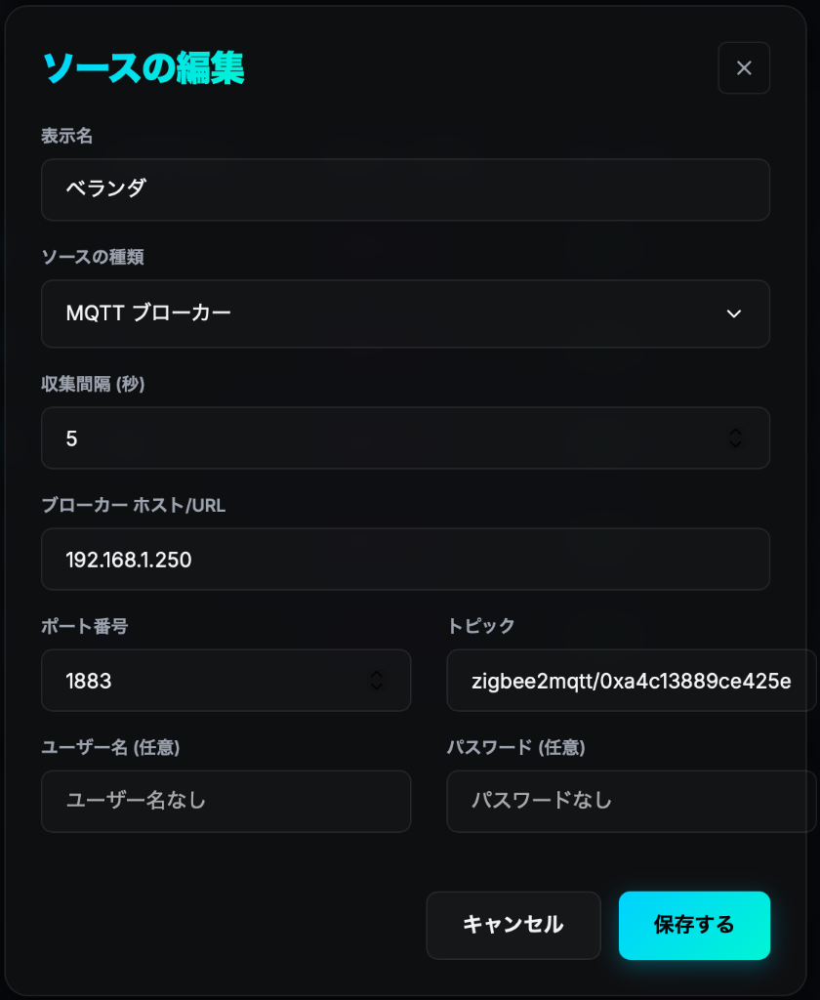
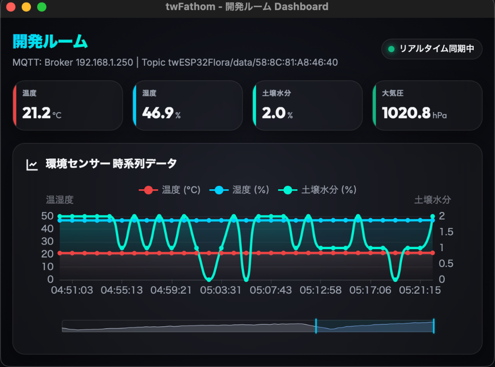
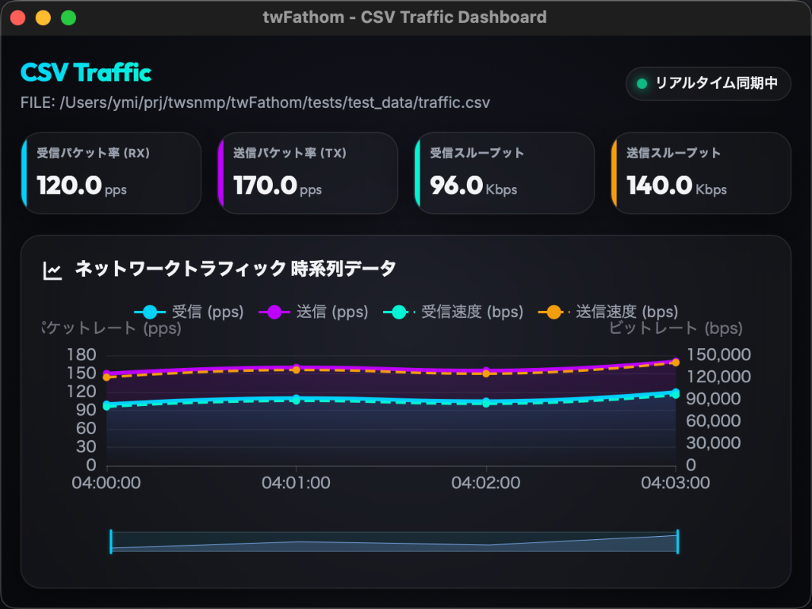

# twFathom
[](https://opensource.org/licenses/Apache-2.0)
[](https://www.python.org/)

**AIでデータを深く理解する。CSV、MQTT、APIソースを、pywebviewを通じて知的に分析・可視化するTWSNMPシリーズプロジェクト。**

`twFathom` は、ローカルファイル（CSV/JSON）、MQTT、および外部のHTTPS APIからデータを定期的に収集し、美しくインタラクティブなダッシュボード上で知的に分析・可視化するためのオープンソースのデスクトップアプリケーションです。


---

## 🌟 主な特徴

- **最新OS対応**: Apple Silicon (M1/M2/M3) Mac および Windows 11 に完全対応しています。
- **プライバシー重視**: 収集したデータは一切クラウドには送信されず、あなたのPC内のローカルデータベース (SQLite) にのみ保存されます。
- **柔軟なデータソース**: HTTPSポーリング、ローカルファイル監視（CSV/JSON）、MQTTサブスクリプションの3つのデータソースをサポート。
- **データ自動判別・パース**: 入力されたデータ形式を判別し、環境データまたはトラフィックデータに自動マッピング。
- **インタラクティブな推移グラフ**: スムーズでズーム可能な美しいグラフ表示により、時系列データの詳細な変化をキャッチ。
- **信頼の 'tw' シリーズ**: ネットワーク管理ツール「TWSNMP」シリーズの開発者による、透明性の高いプロジェクトです。

## 📊 サポートする測定項目

アプリは自動的にデータソースを解析し、以下のいずれかのスキーマにデータをマッピングします：

### 🌡️ 環境 (Environment) データ
- **温度** (Temperature)
- **湿度** (Humidity)
- **気圧** (Pressure)
- **CO2 濃度** (CO2)
- **土壌水分** (Soil Moisture)
- **照度** (Illuminance)

### 🔌 通信トラフィック (Traffic) データ
- **受信パケット数** (Rx PPS)
- **送信パケット数** (Tx PPS)
- **受信帯域幅** (Rx BPS)
- **送信帯域幅** (Tx BPS)

---

## 📱 対応データソース仕様

### 1. HTTPS (API ポーリング)
指定したURLに対し、GETまたはPOSTリクエストを定期送信してJSONデータを取得します。

### 2. FILE (ローカルファイル監視)
ローカルのCSVやJSONファイルの更新（mtimeの変化）を自動的に検知し、最新データを読み込みます。

### 3. MQTT (リアルタイム受信)
MQTTブローカーに接続し、指定したトピックにパブリッシュされるデータをリアルタイムに受信します。

---

## 📦 インストール方法

### macOS
最新のリリースから `.pkg` インストーラーをダウンロードして実行してください。
*注意: アプリは Apple による公証(Notarized)を受けており、安全に実行できます。*

### Windows
最新のリリースから `.msi` インストーラーをダウンロードして実行してください。

---

## 🚀 使い方

1. **データソースの追加**:
   アプリを起動し、**「ソース追加」**から新しいデータソースを登録します。ソースの種別（HTTPS / FILE / MQTT）を選択し、URL、ファイルパス、ブローカー情報を入力します。
2. **データの収集開始**:
   登録したソースを「有効 (Active)」に設定すると、バックグラウンドコレクターがデータの収集を定期的に開始します。
3. **ダッシュボードでの可視化**:
   ソースリストからダッシュボードを開くと、個別の分析ウィンドウ（初期サイズ 640x480）が開き、グラフなどでデータの推移を確認できます。データソースの削除ボタンは分かりやすく赤色で強調されています。

---

## 💾 データの保存場所

すべてのデータは、お使いの PC 内のローカル SQLite データベースに保存されます。

- **保存先ディレクトリ**: `~/.twfathom/twfathom.db` (ホームディレクトリ下の `.twfathom` フォルダ内)
  - **macOS**: `/Users/ユーザー名/.twfathom/twfathom.db`
  - **Windows**: `C:\Users\ユーザー名\.twfathom\twfathom.db`

---

## 📸 デモ & スクリーンショット

### アプリケーション画面
| メイン画面（ソース一覧） | ソースの追加・編集 |
| :---: | :---: |
|  |  |

### ダッシュボード & 分析
| 環境モニター画面 | トラフィックモニター画面 |
| :---: | :---: |
|  |  |

---

## 🛠 開発者向け

このプロジェクトは、[TWSNMP](https://github.com/twsnmp) の開発者によって維持されている **'tw'シリーズ**の一部です。

### 開発環境のセットアップ
[mise](https://mise.jdx.dev/) が必要です：
```bash
# 必要なバージョンのPython等のインストール
mise install
# 仮想環境の構築と依存パッケージのインストール
mise run setup
```

### 開発・ビルドコマンド
- **開発実行**: `mise run dev` (briefcase 開発モードでアプリ起動)
- **テスト実行**: `mise run test`
- **ビルド（ローカル確認用）**: `mise run build`

### リリース・パッケージング
- **macOS (署名・公証付き)**:
  環境変数 `DEVELOPER_ID_APPLICATION` および `DEVELOPER_ID_INSTALLER` に開発者IDを設定した状態で実行します。
  ```bash
  mise run release-mac
  ```
- **Windows**:
  リポジトリの main ブランチにプッシュされると、**GitHub Actions** が自動的にビルドを開始し、`.msi` インストーラーを生成します。

---

## 📄 ライセンス

**Apache License 2.0** の下で公開されています。詳細は [LICENSE](LICENSE) を参照してください。
